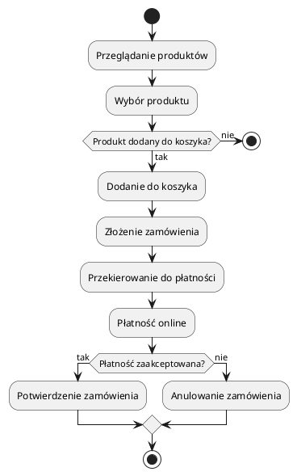

```plantuml
@startuml
start
:Przeglądanie produktów;
:Wybór produktu;
if (Produkt dodany do koszyka?) then (tak)
    :Dodanie do koszyka;
else (nie)
    stop
endif
:Złożenie zamówienia;
:Przekierowanie do płatności;
:Płatność online;
if (Płatność zaakceptowana?) then (tak)
    :Potwierdzenie zamówienia;
else (nie)
    :Anulowanie zamówienia;
endif
stop
@enduml
```