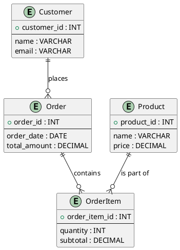

[MAIN](../README.md)
[https://plantuml.com/er-diagram](https://plantuml.com/er-diagram)

```plantuml
@startuml

entity "Customer" as customer {
    +customer_id : INT
    --
    name : VARCHAR
    email : VARCHAR
}

entity "Order" as order {
    +order_id : INT
    --
    order_date : DATE
    total_amount : DECIMAL
}

entity "Product" as product {
    +product_id : INT
    --
    name : VARCHAR
    price : DECIMAL
}

entity "OrderItem" as order_item {
    +order_item_id : INT
    --
    quantity : INT
    subtotal : DECIMAL
}

customer ||--o{ order : "places"
order ||--o{ order_item : "contains"
product ||--o{ order_item : "is part of"

@enduml

```
