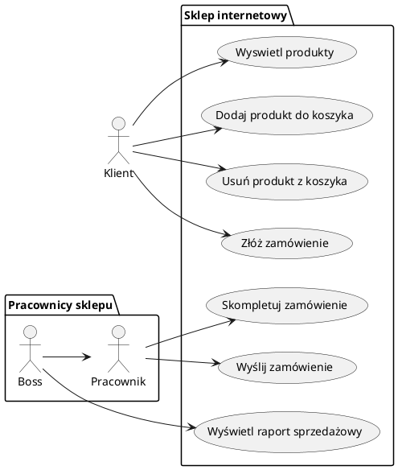

[MAIN](../README.md)

```plantuml
@startuml
left to right direction
actor Klient as k
package "Pracownicy sklepu" {
  actor Pracownik as p
  actor "Boss" as pb
  pb --> p
}
package "Sklep internetowy" {
  usecase "Wyswietl produkty" as UC_k1
  usecase "Dodaj produkt do koszyka" as UC_k2
  usecase "Usuń produkt z koszyka" as UC_k3
  usecase "Złóż zamówienie" as UC_k4

  usecase "Skompletuj zamówienie" as UC_p1
  usecase "Wyślij zamówienie" as UC_p2

  usecase "Wyświetl raport sprzedażowy" as UC_pb1

}

k --> UC_k1
k --> UC_k2
k --> UC_k3
k --> UC_k4

p --> UC_p1
p --> UC_p2
pb --> UC_pb1

@enduml
```
